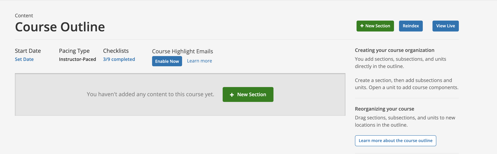
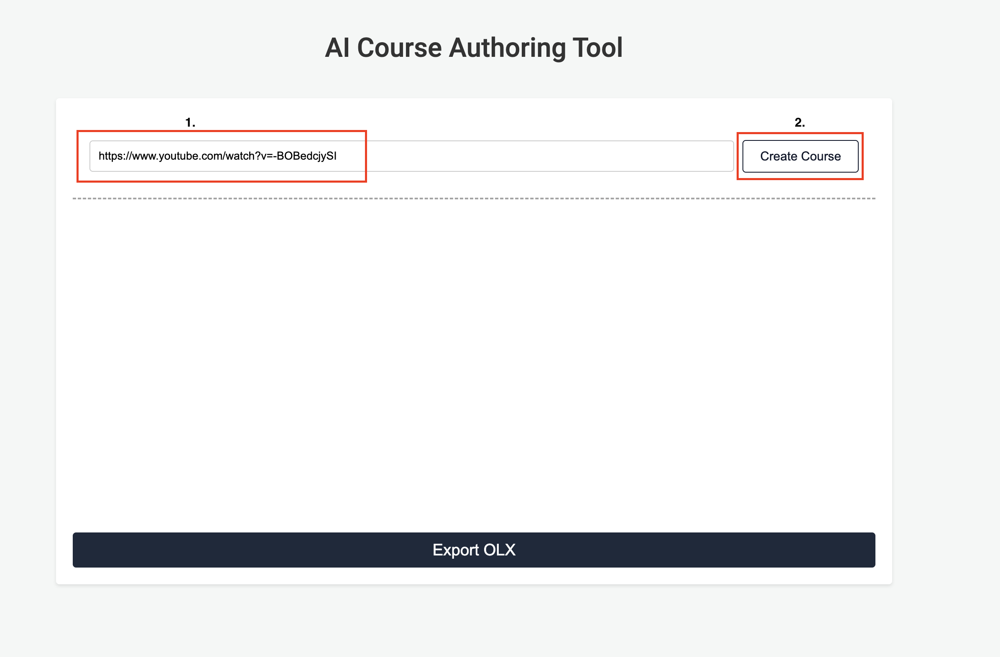
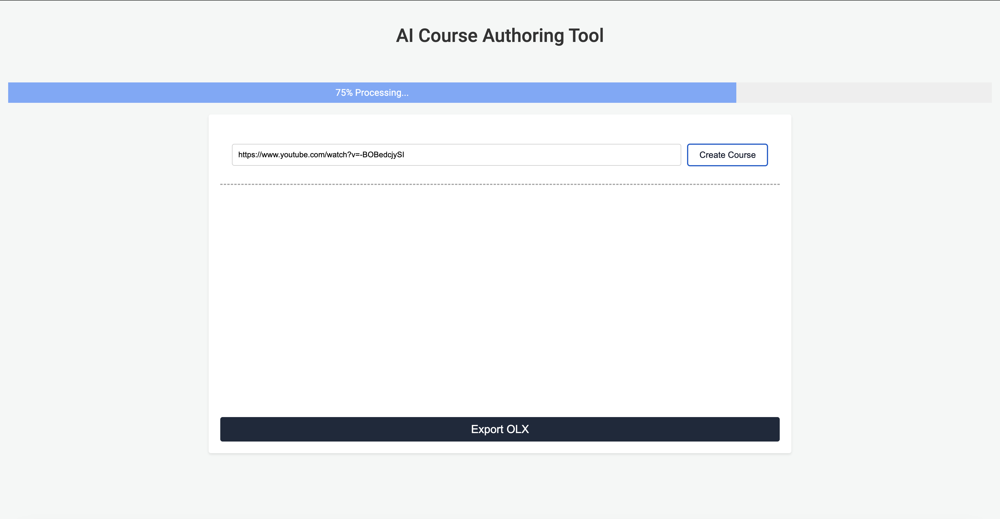
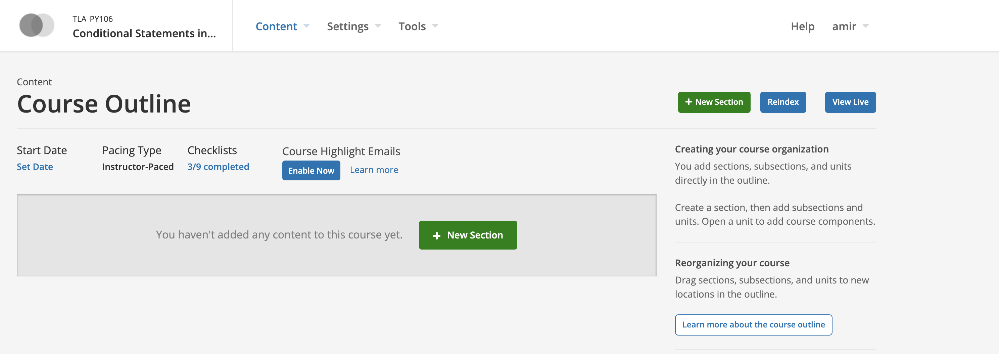
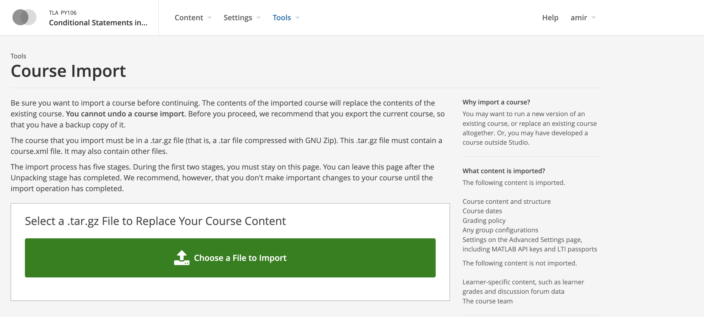
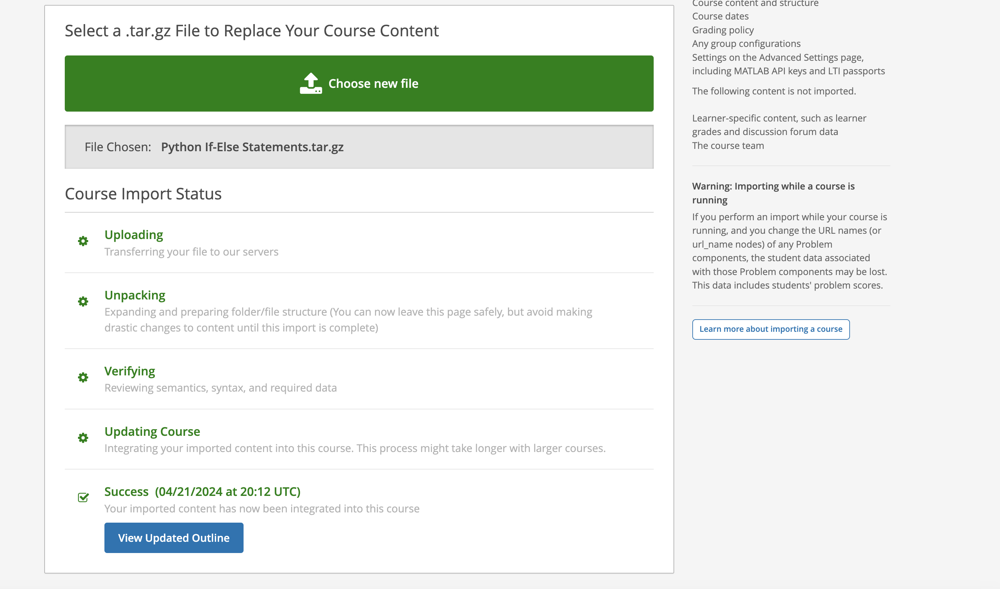

# AI-Driven Course Creation: Crafting Engaging Content in Open edX with LLM

## Introduction

Creating a new course from scratch on Open edX? It sounds exciting, right? But it can also feel like you're at the foot of a mountain, looking up. That first page – a blank page waiting for your ideas – is both an opportunity and a challenge. Look at it: all clean and empty, ready to be filled with sections and interactive elements that will soon hold your course's soul.

But let's be real. Turning this bare outline into a rich learning experience can be tough. There's so much to do: mapping out the content, designing activities, and all the clicking and typing in between. It's the kind of work that makes you wish for a magic wand to make it all come alive.

What if I told you that magic is kind of real? Not with a wand, but with the power of AI. What if we could take the tediousness out of the picture and let intelligent technology lend us a hand? That's exactly what we're diving into. We're leveraging the advanced capabilities of Large Language Models (LLM) to generate foundational content. This isn't about replacing the human touch; it's about augmenting your creative process with AI efficiency.

### AI-Powered Content Generation

By developing a model that feeds on diverse content sources – be it a YouTube video, official documentation like the latest Python documentation, or PDF content – to construct the foundation of our course. This model only uses the content provided and in this way, it provides an insightful learning experience without any hallucination or fabricated information. The model is trained on what a good course looks like and provides its response based on that.

The model also has APIs to integrate it with other tools like editors to make sure we have control over the content, we can edit, improve, and polish it.

The following is a RAG (Retrieval augmented generation) application that gets fed on [python 3.12 what's new doc](https://docs.python.org/3/whatsnew/3.12.html) and creates a short course based on that.

## AI, LLMs and RAG

In the heart of our content creator tool lies a blend of technologies that might sound complex but are quite straightforward. **Artificial Intelligence (AI)** refers to machines designed to mimic human intelligence. Within AI, we have **Large Language Models (LLMs)**, which are like vast, interactive libraries that understand and generate text in human-like ways. **Retrieval Augmented Generation (RAG)** combines the best of both worlds: _it fetches accurate information (retrieval)_ and _then creatively molds it into new content (generation)_. Think of it as a diligent researcher and a creative writer rolled into one. Our application uses these technologies to transform various content into structured educational experiences.

## From AI Draft to Open edX: Refining and Delivering the Course

In the previous step, We used AI to generate our information but that was just the beginning. It's highly important to add a human touch to our content to transform that information into wisdom. For this step to bridge the gap between AI-generated content and delivering it to Open edX, we use an editor that makes an API call to model APIs, retrieve AI-generated data, and provides a way for us to edit it and when we are done we can export it as [OLX](https://openedx.org/blog/open-learning-xml-olx-format/) format to load it to Open edX.

Here is the breakdown of the steps we are going to follow to create our course:

1. **Fetch AI-Generated Content**: Our Editor communicates with the AI model, providing it with the link to our selected content source.
1. **Receive Structured Data**: The model processes this content and returns a structured draft of the course, complete with sections, subsections, and initial assessments.
1. **Load Into Editor**: This draft is then loaded into the editor, laying out the foundation for the course.
1. **Edit and Enhance**: With the editor, you have the freedom to fine-tune every detail—adjusting the narrative, enriching content, adding multimedia elements, and aligning it with learning outcomes.
1. **Export as OLX**: Once we're satisfied with the course content, the editor allows us to export the entire course as an OLX (Open Learning XML) file.
1. **Import to Open edX**: The final step is to take this OLX file and import it into Open edX.

### Let's see how it works

Imagine we create a video lecture on YouTube about `Python if-else stetements`. Now we want to creat a short Open edX course using that video.

1. Let's enter the video link in the input element of the Editor and click on **Create Course**

2. After clicking on the button, the editor makes a call to the model's API and it retrieves the generated content and loads it to the editor.

We should see something like the following in the editor.

3. Now, Let's fine-tune and enhance our content in the editor, and when we are done click on **Export OLX**

If our content structure is a valid OLX, the file gets downloaded.

> In this example I only added some stylings and a new component [Python Code Executer](https://wasmeditor.com/) to our course. Remember, this is just a starting point. The essence of a truly successful course lies in the personalized touch you bring to it. AI may lay the foundation, but it's the insight and expertise of an instructional designer that transform this base into a successful learning experience.

4. Importing the Course into Open edX

Now let's go to our course in the Open edX and navigate to the `/import/course-v1:TLA+PY106+2024_Q1` URL and Click on **Choose a File to Import** to pick and import the file downloaded in the previous step

5. Confirm the Course Structure

Now let's navigate to LMS to confirm our course looks as expected

As you can see we could successfully import our course to Open edX

## Conclusion

In this post, We talked about how AI can help us to speed up the content creation in Open edX but we've only skimmed the surface of what's possible.

The speed at which AI is evolving promises an even brighter future to have better learning experiences and student engagement. 

If you are interested in using this tool with your Open edX instance feel free to [reach out to me](mailto:amir@cubite.io) and I would be more than happy to keep you posted about the development process and give you beta tester access.

